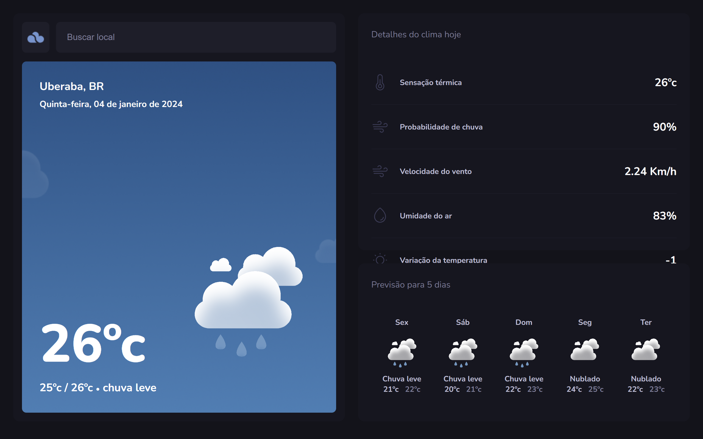
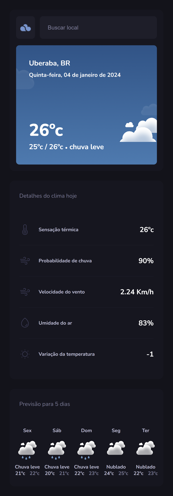

# TypeWeather ⛅ 

- Projeto do módulo bônus de Typescript para o Explorer | Rocketseat

<h2 id="technologies">🖥️ Tecnologias</h2>

- Axios
- React
- ReactDOM
- React Router Dom
- TypeScript

## 👩‍💻 Author
Made with 💜 by Aline
<table align="left">
    <tr align="left">
        <td>
            <a href="https://github.com/alineviana">
                
                
👩🏽‍💻 Aline Viana
 
            </a>
        </td>
    </tr> 
</table>